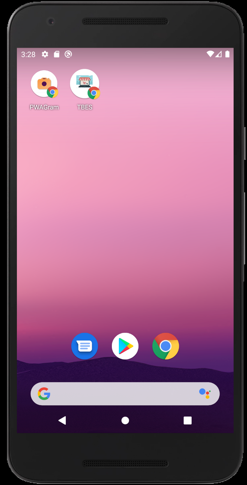

# eCommerce
This app was created with React. I use HTML, CSS, bootstrap, javascript, node.js and MongoDB database.
The purpose of this repository it's for education and test. But the code it's being coded correctly. 

On this page, I am selling electronic products(tv, drones, speakers, etc..). I also have a contact page that allows the client to send a message and it will be saved in the database. 

# Look on Phone 

## Icon on the phone
Display the icon of the store on a cell phone 

## 
This demonstrates that my front end react application was able to fetch data from my .NET backend

## Read
This demonstrates that my front end react application was able to fetch data from my .NET backend

# Installation
* Open terminal.
* git clone https://github.com/christiamenrique/EcomWithPWS.
* Once is clone node.js is required to operate the page. You must use npm install.
* Before starting the application you must create a mongo database.
* Link to the mongoDb data in the inside .env.
* To start the application run React app using npm run start.
* I also included the automated test which test the api's. The command to run this test is npm test.
* To run the test mocha and chai are required. The command is npm install mocha, npm install chai.

# Features:
* Signup and Login auth process, displaying ‘admin page’
* Uses bcrypt encryption protocol and JWT
* Nav bar with a logo
* Footer with links to my page and copyright
* Main page with a carousel slide
* Products page that allows you to see all products
* Filter products	from low to high and high to low prices
* Contact page that allows you to enter your name, phone number, email and comment
* Contact page also has a jumbotron
* All input field has html validation
* It has a api Routes, node server, morgan which is use to see the loggins
* It has a design diagram which include the ERD (Entity Relationship Diagram)
 and FDD (functional decomposition diagram) of the application

# Demo
* https://ecom-with-pwd.herokuapp.com/login

# Author
* Christiam Hernandez

# License
* This project is licensed under the MIT License - see the LICENSE.md file for details

